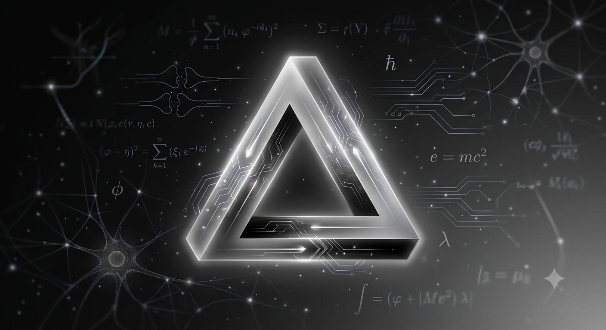

Human wellbeing ultimately depends on the progress of our society, and this progress relies heavily on scientific discoveries. It is not important whether these scientific breakthroughs come from a human or an artificial being, just as it might not be of fundamental importance if artificial beings feel and are "conscious" in the way we assume we are. Still, I find it truly fascinating how many people assume that human genius is merely an extrapolation of existing knowledge. Indeed, we regularly use combinational and exploratory knowledge in our daily lives, and some of us can even use transformational knowledge to break existing boundaries, to create something completely original, something far outside the realm of existing knowledge. But existing with respect to what?

I believe machines can easily use combinational and exploratory knowledge, but what about going outside the boundaries of their training dataset? In a computational system, existing knowledge is inherently limited to the training dataset; in humans, this training dataset, our dynamic environment, constantly changes.

I love the pattern between how we train a language model and how a person comes to be. Pre-training is remarkably like DNA. Evolution compressed billions of years of trial and error into a compact genome, and natural selection picked the resilient ones that survived. Pre-training an LLM is like our own evolutionary journey over the past 300,000 years.

Mid-training behaves just like our early life. Our unique character is shaped by our early childhood experiences, driven by a natural form of reinforcement learning drawn from the tests given by our parents and teachers through reward and punishment.

Post-training is the world we are eventually released into. The surrounding environment, culture, relationships, and institutions provide an ongoing preference signal from the people around us, shaping our tone and values long after our base architecture is set, functioning closely to how RLHF guides an LLM.

Some people suggest that AI hallucinations, or simply increasing the temperature of an LLM, is similar to the human genius who stops blindly following existing rules and tries to explore entirely new paths.

Yet, all the LLM reasoning is rooted in induction, relying on extrapolation from data. Perhaps what truly separates us from machines is the genuine "understanding" of these steps. Or the dynamic, physic-based environment we are living in.

Because I find this topic fascinating, and while I believe machines can certainly be creative in their own unique way, I also deeply hope they can never replicate the depth of human creativity for example in art and music. That is why, I wrote this premise before exploring how some of our greatest human minds counter-argue this topic.

## Deutsch, Penrose, and the AI labs

Evolution is the creation of knowledge through variation and selection. And yet, it is amazing that the DNA code has enough reach to describe everything from simple cells to dinosaurs and humans. Somenthing we still cannot fully explain.
Nature holds many unresolved mysteries: the nature of qualia (feelings), and the "hard problem" of consciousness. Trying to achieve these artificially, without ever discovering those unknowns, cannot work. As long as we cannot explain the common language of art and music, why certain flowers look beautiful, or why we feel happy or sad, how can we expect to simulate any of it in a computer program?

AI is a computational process; it uses pre-existing knowledge to predict the next token. The question here is whether AI will be able to help us in this infinite expansion of knowledge. Some people try to answer to that question by answering to whether AI can be conscious, can "understand".
Current AI is built on inductive principles: optimizing against training data or objective functions. So, it can recombine and extrapolate existing patterns, but it cannot originate genuinely new explanatory knowledge or question its own goals (so far).

We, humans, are universal explainers, capable of creating explanations. New explanations create new problems, inevitable but soluble problems.
David Deutsch argues that digital computers are universal too, similar to human brains. But the problem lies in the program that runs on them. Deutsch rejects induction (learning by extrapolating patterns from data) as a valid theory of knowledge at all. He holds that real creativity means generating new explanations through bold conjecture and error-correction, ideas that go beyond, and sometimes against, the data, rather than ones derived from it. Hardware is not the source of creativity. Even if we were able to recreate the brain, it wouldn't be creative on its own. What matters is the program running on it, the conjecture and criticism that generate new knowledge.

On the other hand, Penrose says no; a computational process, by definition, cannot be creative. He draws on Gödel's theorem: in any consistent formal system, there are specific true statements that cannot be proven within that system. In other words, any sufficiently powerful, consistent formal system will contain true statements that cannot be proven using its own rules. Because computation is bound by these formal systems, Penrose argues it cannot replicate the human mind's ability to recognize these unprovable truths. This suggests consciousness accesses something beyond computation.
Penrose proposes that consciousness arises from quantum collapse in microtubules. When a quantum superposition reaches a threshold of mass-energy, the wave function collapses spontaneously. Penrose ties consciousness to these collapses (which are not yet proven).

He imagines three worlds: math, physics, and mind, linked in a loop. Math comes first: it exists on its own, timeless and independent of us. Only a tiny piece of math describes the physical world. From the physical world, only a small part gives rise to conscious minds. And from the mind, a small part of our thinking, our ability to understand math, somehow reaches back and grasps the entire mathematical world we started with.

If Deutsch is right, AGI is a software problem; that is, we need an algorithm for conjecture, a different architecture (see Yann LeCun) or a llm self-evolving (simulated) environment.

If Penrose is right, AGI is a hardware/physics problem (we need quantum biological computing).

And if Sam Altman, and most of the AI labs, are right, true understanding is an emergent property of scaling laws, where a future iteration like GPT-8 might be able to solve quantum gravity through data alone.

Probably, the day AI becomes conscious, and able to explain new knowledge on its own, will be the day we reach AGI.

But even if that day never comes, the potential to apply AI to improve our daily lives remains huge, a once-in-a-lifetime opportunity. And as Popper reminds us, it is our duty to remain optimists.
""
