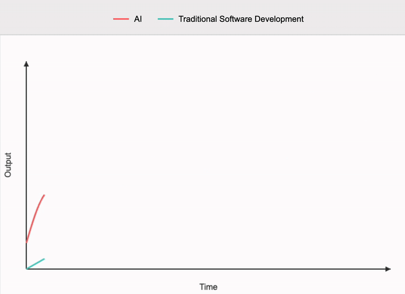
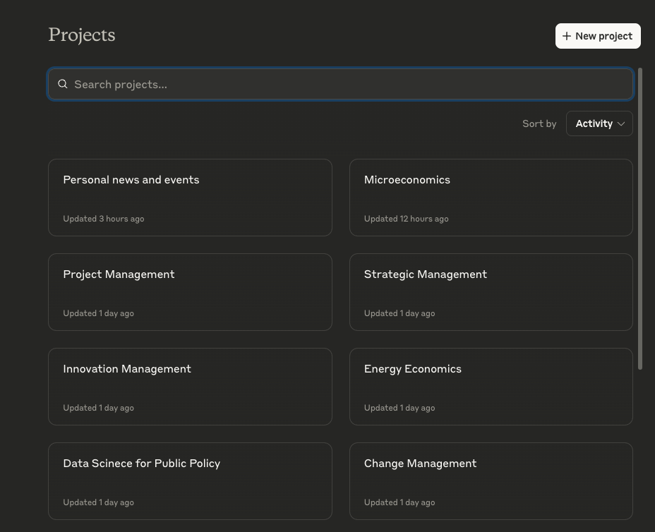
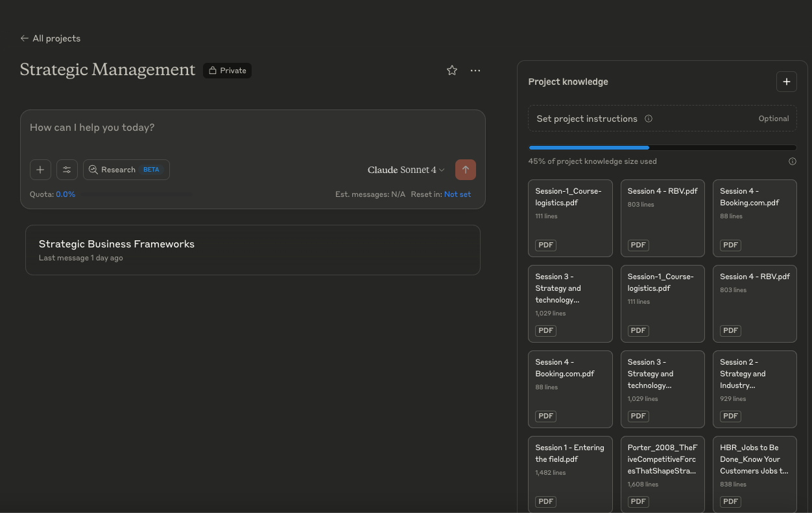

import VideoEmbed from '../../../components/VideoEmbed.astro';
import DomainKnowledgeAlbum from '../../../components/DomainKnowledgeAlbum.astro';

*"With AI taking care of coding, humans can instead focus on more valuable areas of expertise and concentrate on domain knowledge."*

Lately, I have experimented with different AI tools, and I can also say: without domain knowledge, AI is not particularly useful. Actually the illusion of a better output could be something like this:

For example, I built a complete data science project (EnergyForecaster on [GitHub](https://github.com/SecchiAlessandro/EnergyForecaster)) that forecasts energy prices, load demand, and renewable energy generation for the next five years. The objective was to generate strategic investment insights—such as investing in batteries where forecasted renewable energy surplus is higher, or in grid flexibility solutions.

Using Task Master MCP (I will explain briefly later what is an MCP) and Claude Desktop, I generated the full repository through well structured prompting and created a web presentation out of it. (Note: Task Master MCP allows the LLM to act as a project manager, creating structured tasks and sub-tasks. However, with the latest advanced reasoning models, this approach is probably not necessary.)

The main lesson learned was the critical importance of providing detailed domain knowledge—telling the AI which key concepts to use and providing comprehensive instructions. The more detailed the instructions, the better the results. This is the only way to avoid hallucinations and achieve interpretable, understandable answers 📊.

That's why I decided to track my recent studies with mind maps, which can be used in initial prompts for different types of projects. I believe AI can be used as an extended brain with larger memory, rather than as a completely different brain.

<DomainKnowledgeAlbum />

That is why, I have created different projects in Claude with specific domain knowledge from my latest classes in Management (full of frameworks that can be difficult to remember and to match with your use case).

This approach is especially useful for applying already-understood and interpretable concepts to existing concrete problems or business projects—functioning as a sort of personal consultant and mentor.

**Why is Claude more useful than ChatGPT?**

Claude Desktop is particularly effective in providing the flexibility to leverage your domain knowledge, primarily through MCP (Model Context Protocol). Some say it is the equivalent of the TCP/IP protocol that allowed the internet to become what it is today.

The Model Context Protocol is an open, application-layer protocol developed by Anthropic to standardize the integration of large language models with external tools, data sources, and services. It essentially accelerates communication between AI agents and various API calls and tool invocations.

Let me showcase some of my latest side projects with these tools:

**Integrated Project Management Automation**

Combining Google Drive and Gmail integrated knowledge in Claude with MCP from Asana and domain knowledge in project management best practices, I could plan the tasks for an entire complex project for the team.

In the demonstration, you can see how the LLM reads an entire Google Drive folder containing long project specifications, requirements, and Excel files with time, cost, and resource allocation. It then reads the latest relevant emails and automatically creates the complete project in Asana, assigning due dates and customer requirements.

<VideoEmbed src="/media/PMAgent.mp4" label="Integrated Project Management Automation" />

**MVP Web Application Development**

Using Claude Code or Cursor to build an MVP web application for your service department—a beta version to test with your most reliable customers.

<VideoEmbed src="/media/ServiceApp.mp4" label="MVP Web Application Development" />

**Financial Intelligence Agent**

An agent that can scrape the web and, through MCP from Yahoo Finance, identify undervalued listed companies based on latest emerging trends and financial indicators (which should still come from your domain knowledge).

<VideoEmbed src="/media/ValueInvesting.mp4" label="Financial Intelligence Agent" />

**Conclusion: The Future of Human-AI Collaboration**

This approach reinforces my belief that we are moving toward a future where AI augments human capabilities rather than replacing them. The key is maintaining human expertise and domain knowledge while leveraging AI's computational power.

The goal is not automation for its own sake, but intelligent augmentation that enhances human creativity, decision-making, and productivity across complex, real-world challenges.

*— Through the Energy Transition, Towards the Singularity.* ⚡
