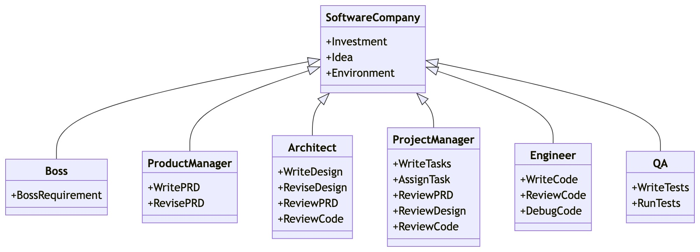
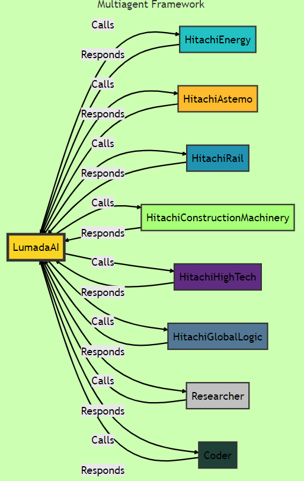
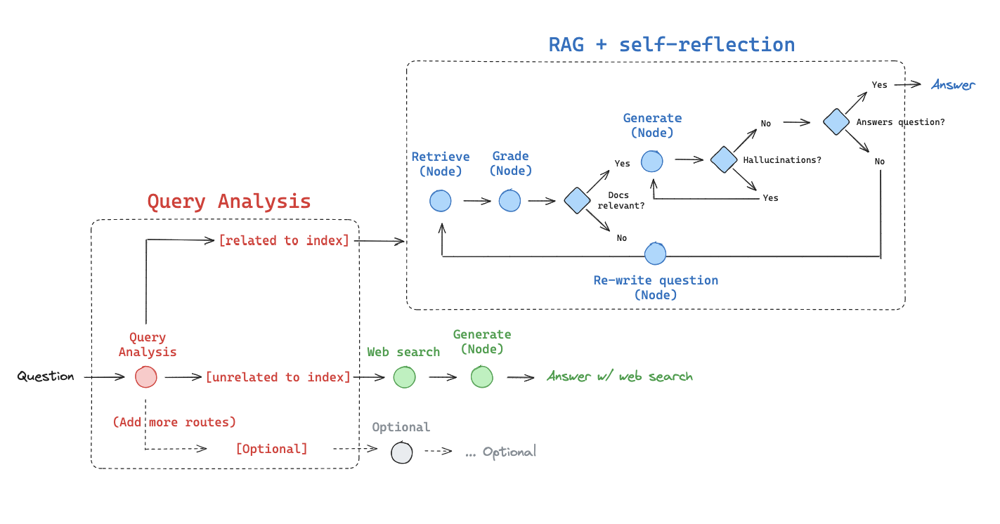

import VideoEmbed from '../../../components/VideoEmbed.astro';

More frequently, I hear talk about highly specialized small agents in a multi-agent frameworks.

CrewAI, LangGraph, MetaGPT, LlamaIndex, Autogen are the most famous ones used in interesting application such as:

📨 Automating the process of checking new emails and creating drafts based on internal know-how.

👨‍💼 Replicating the structure of a software company (each agent is trained on their job profile), where from a single line requirement as input, it outputs competitive analysis, data structures, APIs, documents, software repository (see Pythagora 🤯)..

Working at one of the Hitachi companies, gave me the inspiration to build a multiagent framework to exploit the huge amount of knowledge in information technology (IT) business as well as the operational technology (OT), a special combination that only a few companies can afford.

Therefore, by looking at the Lumada concept, I tried to build an application with LangGraph, where each agent is trained on the respective company data (scraped from the website section: products and solutions) and the supervisor (LumadaAI) can choose a specific agent (company) to perform the RAG (retrieval augmented generation) on the training data. In addition, I have added two agents called "Researcher" and "Coder" to perform a general web search and basic data analysis calculations.

In this framework, each agent is a node in the graph, and their connections are represented as an edge. The control flow is managed by edges, and they communicate by adding to the graph's state.

With LangGraph I could create a cyclical and non-linear workflows where the agents can revisit and refine their actions based on new data, leading to more accurate and efficient outcomes. **Specialization, collaboration, flexibility and scalability** are the main advantages of this kind of multi-agent systems.

This is a basic prototype and many improvements are possible:

- Improve the RAG code with a self-corrective logic (which incorporates self-reflection / self-grading on retrieved documents)
- Increase the number and quality of training data
- Add an agent trained on the customer's data
- Improve the quality of the user prompt

In the example below, I asked LumadaAI to support me in the planning, building, operating and maintaining of a new hospital.

The tool is retrieving information from Hitachi Energy, Hitachi Astemo, Hitachi HighTech, Hitachi Rail, Hitachi Construction Machinery and GlobalLogic.

🟢 I believe this kind of application can enhance the general human **creativity** and support many jobs by reducing the complexity of the problem, combining a huge amount of data, to come up with new products and solutions.

<VideoEmbed src="/media/chatbot.mp4" label="LumadaAI demo" />

*"Coined from the words "illuminate" and "data", the name Lumada embodies our goal of shining a light on our customers' data and illuminating it in such a way that we can extract new insight, thereby resolving our customers' business issues and contributing to their business growth."*

*"Toward singularity, through the energy transition."*
