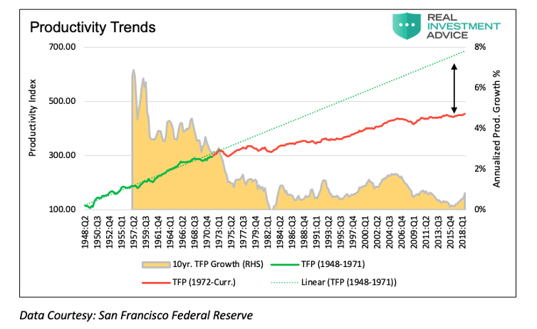
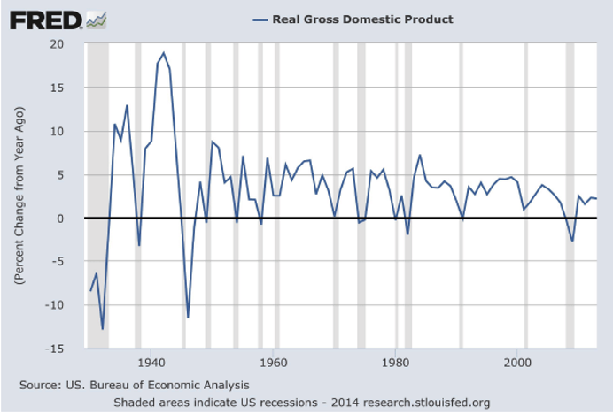
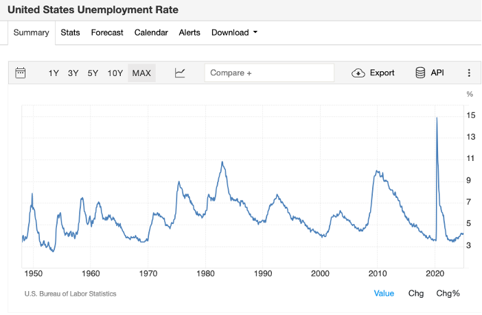
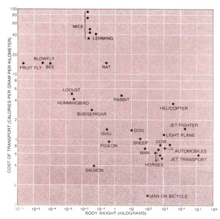

import GooglePhotosAlbum from '../../../components/GooglePhotosAlbum.astro';
import { albums } from '../../../data/albums';

I recently received the Inspiration of the Year Global Award ([IYGA](https://www.hitachi.asia/iyga/aboutiyga.html#:~:text=IYGA%20is%20Hitachi's%20annual%20brand,excellence%20within%20the%20Hitachi%20Group) - section Sustainability). A good opportunity to take a break from the usual working routine and to reflect on the meaning of sustainability in the Energy and AI transition.

🌱 Sustainability means electrifying everything we can, increasing the quota of renewable sources, and investing in solutions to make the grid more **flexible**.

💡 HITACHI has a broad portfolio both in IT and OT which could lead this transition, using AI to increase the employee's productivity, to find synergies and new ideas in order to generate the so-called "social innovation business".

However, the direction set by most of the high-tech companies might not be the best course of action to ensure a sustainable future. That's why I have written down some general thoughts about the **trajectory** of this transition:

## Total factor productivity growth rate ↓

Measured TFP growth has slowed in many advanced economies compared to the mid-20th century. While the digital revolution has enhanced **productivity**, its effects are less directly visible in traditional TFP metrics than those of earlier, more disruptive innovations (electricity, motor vehicles, indoor plumbing...).

## GDP growth rate ↓

GDP growth has slowed in many advanced economies. Of course, this moderation reflects not only slower TFP growth but also factors like demographic trends, climate and energy crisis, and economic maturity.

## Unemployment growth rate cyclical

The relationship between technological progress and unemployment is complex because it involves both job destruction and job creation, as well as broader economic and social factors. The net effect on employment depends on how well societies adapt to these changes through education, policy, and innovation.

Historically, technological progress has not led to mass unemployment. For example, the Industrial Revolution initially caused job losses in agriculture but eventually created millions of new jobs in manufacturing and services.

However, the AI revolution is something new. If AI adoption is unchecked, **wealth concentration** may increase, job displacement could dominate, and the natural rate of unemployment may rise permanently.

## Why?

Productivity gains are no longer significantly enhancing the production function of modern economies in the way they once did. In the 1940s, innovations like electricity use empowered workers to achieve higher output by revolutionizing industrial processes. By the 2000s, computers primarily redirected labor toward new sectors (e.g., IT, digital services) rather than universally boosting productivity.

Today, AI-driven **automation** represents a further shift: it aims to replace human roles (e.g., computer use, operator, agents...) rather than augmenting human capabilities or creating entirely new industries. Perhaps, robotics and autonomous systems (e.g., self-driving cars, warehouse robots) will create massive new industries, but unlike past technological leaps, these sectors may not generate proportional human employment. The "big new AI industries" could profit only a few tech giants, **highly profitable but labor-light**.

This divergence risks a **"productivity-prosperity paradox"**: GDP and tech corporate profits may grow, but labor's share of income could decline, reducing the **"shared prosperity"**.

## What's next?

Considering the fast pace of AI development, and the pursuit of AGI from many tech leaders, I expect to see in the next 5-10 years, an **increase in GDP growth, as well as an increase in unemployment**.

This might force governments to act on this AI revolution with new policies against complete automation.

That's why I'm developing and exploring the use of personal AI assistants to augment human abilities and unleash creativity for open innovation from the bottom up.

A future where computers act as "bicycles for the mind". See the picture below where the "man on a bicycle" represents the most energy-efficient form (per unit of body weight) of moving on earth. **Augmentation instead of automation.**

**Some pictures about the awards ceremony in London:**

<GooglePhotosAlbum {...albums.hitachiIyga} />
