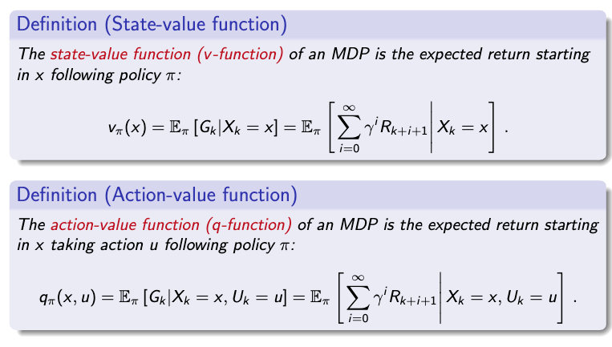
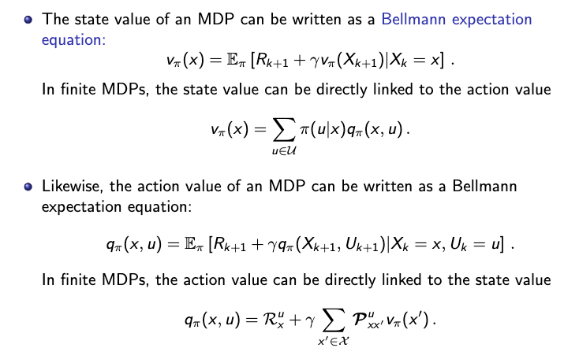
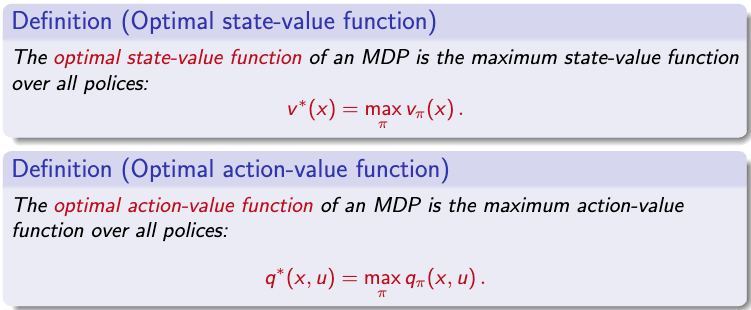
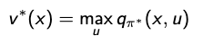
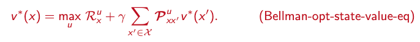
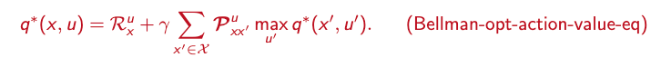
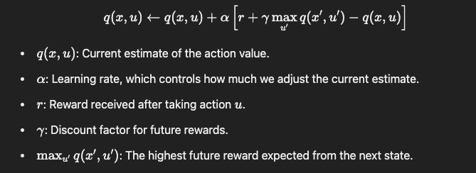

## Feed Forward Networks ⚡

One key concept is the so-called **universal approximation property**, which already holds for shallow neural networks with arbitrary width, consisting of an input layer, one hidden layer, and an output layer..

Indeed, at the end of the eighties, it was proved by **George Cybenko** that neural networks with only one hidden layer and bounded sigmoidal activation functions (i.e., limx → ∞σ(x) → 1 and limx → −∞σ(x) → 0) can approximate generic classes of functions.

**Kurt Hornik** showed in 1991 that it is not the specific choice of the activation function that leads to the universal approximation property, but that it works for generic continuous non-polynomial functions.

## CNN vs. Standard Feed Forward Networks 🖥️

A **CNN** (Convolutional Neural Network) differs from a standard feed forward neural network by the structure of hidden layers.

- The hidden layers of a CNN typically consist of a series of **convolutional layers**.
- The word **convolution** is rather a convention, coming from the replacement of the matrix vector product by a sort of convolution. Mathematically, it is actually a sliding dot product.

## Recurrent Neural Networks (RNNs) 🔄

**RNNs** are a class of artificial neural networks for sequential data processing. They exhibit a temporal dynamic behavior where new inputs can enter, making them well-adapted for modeling and processing:

- Text
- Speech
- Time series

**Hopfield Networks** are a type of recurrent neural network.

## Reinforcement Learning (RL) 🕹️

**Reinforcement Learning** maximizes the notion of cumulative reward. It is one of three basic machine learning paradigms, alongside:

- **Supervised Learning**: Develop models to map input and output data (i.e., regression or classification). For a given training data set (xi, yi, i = 1, ..., M), supervised learning means to find the parameters θ of a neural network such that a given loss function L is minimized.

  **Optimization Challenge** — But how to deal with a non-linear, non-convex optimization problem with millions of parameters? With **stochastic gradient descent** where the gradient is replaced by an unbiased estimator.

- **Unsupervised Learning**: Process and interpret data based only on the input (i.e., clustering).

**Training with Self-Play**

The parameters of the network are randomly initialized and trained by **self-play reinforcement learning**. You select moves by **Monte Carlo tree search**, which gives – based on simulated games – probabilities π for the possible moves and game outcome z.

The network parameters are trained to:

- Maximize the similarity of p (move probabilities) and π
- Minimize the error between the predicted outcome v and the game outcome z, i.e., the loss function L.

**Main Definitions**

- **Reward** r: The agent's possibility to maximize the reward over time.
- **State** X: Represents the environment. U is the action space.
- **History**: Considered in state x → Markov state.
- If the agent can directly measure the full environment state, then it is called a **Markov Decision Process (MDP)**.
- **Policy** π: The agent's internal strategy for picking actions.
- **State value function** (v-function): The expected return of being in state x following policy π.
- **Action value function** (q-function): The expected return of being in state xk, taking action uk, and following policy π.

So, the objective is to estimate the v function and q function.

## Model-Based vs. Model-Free RL

- **Model-Based RL**: When the model for the environment and reward function is known (e.g., a Markovian model to predict what happens inside the environment).
- **Model-Free RL**: When model dynamics and rewards are unknown to the agent. The goal is to find the optimal policy while learning the model and rewards (with exploration and exploitation).

**Typical Method**

Typical methods involve **Discrete Time Finite Markov Decision Processes (MDP)**.

**P** is the state transition probability matrix.

- In simple terms: v\*(x) tells the agent how much reward it can expect if it starts in state x and always makes the best choices afterward.
- In simple terms: q\*(x, u) tells the agent how much reward it can expect if it starts in state x, takes action u, and then makes the best decisions afterward.

Considering that:

- An optimal policy must deliver the maximum expected return being in a given state.

So the equations can be rewritten as follows:

- If the environment is exactly known, solving for v\* or q\* directly delivers the optimal policy. Once the values are known, the optimal policy can be derived by always choosing the action that maximizes these values.
- Otherwise, in model-free scenarios, use **value iteration algorithms** (e.g., Q-learning or neural fitted Q-learning or deep policy-based algorithms).

## Q-Learning

The agent explores the environment, tries different actions, and updates its q(x, u) values using this formula:

In **Neural Fitted Q-Learning**: Instead of maintaining a table of q-values for each state-action pair (which can be huge in complex environments), a neural network is trained to predict these values.

1. Collect data first in an "experience replay buffer."
2. Then train from the target neural network, get the loss function, and backpropagate to train the actual Q network.

## Deep Policy-Based Algorithms

- Policy-based algorithms directly learn the policy (the best actions) instead of learning the v\* or q\* functions first.
- The agent uses a neural network to directly map states to actions, optimizing the policy to maximize rewards. 🎉

# Generative AI

Generative AI is typically powered by deep neural networks, especially transformer architectures, which excel at processing large datasets and understanding complex patterns.

## Step-by-Step Through the Transformer with "Cat" 🐱

**1. Input Embedding and Positional Encoding**

- Each word in the sentence "The cat sits" is first converted into an embedding vector. For example, the word "cat" could be transformed into a vector like: **[1.2, -0.8, 0.6, …]**
- Then, positional encoding is added to this vector to capture the position of "cat" in the sentence. After adding positional encoding, "cat"'s vector might look like: **Embedding + PosEnc = [1.4, -0.7, 0.5, …]**

**2. Self-Attention Mechanism 🤔**

- Generate the Query (Q), Key (K), and Value (V) vectors for each word. For "cat," let's say:
  - **Qcat = [0.2, -0.3, 0.5, …]**
  - **Kcat = [0.1, -0.4, 0.7, …]**
  - **Vcat = [0.3, 0.2, -0.6, …]**
- Calculate the attention score for "cat" in relation to other words in the sentence using the dot product of **Qcat** with each word's Key vector:
  - **Scorecat, the = (Qcat ⋅ Kthe) / √dk**
  - **Scorecat, cat = (Qcat ⋅ Kcat) / √dk**
  - **Scorecat, sits = (Qcat ⋅ Ksits) / √dk**
- Apply Softmax to the scores to get attention weights, indicating how much "cat" should "focus" on each word. Suppose the results are: **Weightscat = [0.1, 0.8, 0.1]**
- The attention output for "cat" is a weighted sum of Value vectors: **Attention Outputcat = (0.1 ⋅ Vthe) + (0.8 ⋅ Vcat) + (0.1 ⋅ Vsits)**

**3. Multi-Head Attention 🎯**

- With multiple heads, "cat" has different sets of Q, K, and V vectors per head, capturing various semantic aspects. Outputs from each head are concatenated and transformed to merge back together.

**4. Feed-Forward Network 🔄**

- The attention output for "cat" passes through a feed-forward network to add complexity: **FFNcat = ReLU(W1 ⋅ Attention Outputcat + b1) W2 + b2**

**5. Adding and Normalizing 🌐**

- A residual connection and layer normalization are applied: **Outputcat = LayerNorm(Embeddingcat + FFNcat)**

**Putting It All Together 🧩**

After multiple layers, "cat" will be represented as a vector that captures its meaning in the sentence "The cat sits." This final vector is used for the next steps, like classification or generation. Each layer helps the model build richer contextual understanding, making "cat" aware of its relationship to "sits" and "the" based on the surrounding words and overall sentence meaning.

**Training Objective 🎯**

For language models, the common training objective is to minimize the cross-entropy loss between the predicted sequence and the actual sequence.

# ML in Robotics

Machine Learning (ML) plays a crucial role in robotics, bringing more flexibility and adaptability to robotic systems. Let's break down some core components of ML in robotics, including key concepts, challenges, and potential future directions.

### 📊 Formulate

- Predicting or identifying patterns in data to understand and improve robotic functions.

### 🔍 Formalize

- **Representation**: Choose models that represent data patterns well, such as:
  - Linear regression
  - Random forests
  - Neural networks
- **Evaluation**: Measure model performance to ensure its effectiveness in tasks.
- **Optimization**: Maximize the model's performance on the data given for the best outcomes.

### 🚀 Deploy

- **MLOps**: Establish robust machine learning operations to ensure efficient deployment, monitoring, and scaling of models in robotics.

### 🤖 Control Strategies in Robotics

**Classical Control** — Breaks down the problem into **planning** and **control** phases, simplifying robotic task management.

**Reinforcement Learning (RL)** — Directly optimizes **task-level objectives** and leverages **domain randomization** to cope with model uncertainty. This allows the system to discover more **robust control responses** for better task handling.

**End-to-End Learning Control** — Integrates all steps seamlessly:

Sensors ➔ Perception (learning) ➔ Planning (learning from data) ➔ Control (learning)

### 🧠 Advanced Learning Techniques

- **Optimal Control**: Focuses on finding the best control policy for the robot.
- **Imitation Learning**: Observe an expert and imitate their actions, such as observing the status of a mobile "Aloha" system.
- **Privileged Imitation Learning**: Uses expert knowledge for more efficient learning.

**Policies** — Explicit, Implicit, and Diffusion Policies: Different methods of defining the robot's behavior policy.

**Kalman Filter** — A mathematical method to estimate the internal state of a process, aiding robots in tracking and estimation tasks.

**RL Approaches**

- Model-free vs. Model-based RL: Model-free relies on trial and error, while model-based uses a model of the environment.
- Inverse RL: Learn the reward function by observing an expert. Once learned, it uses RL to create a policy based on that reward function.

### 🤔 Challenges in Building Generalist Robots

- Unstructured and unpredictable environments
- Generalization across embodiments – requires versatile hardware
- Contextual understanding and high-level reasoning
- Multi-tasking and priority balancing – goals and targets can be hard to specify
- Regulatory, safety, and cost-related concerns
- Limited robotic data, unlike the abundant web-scale text and image data
- Constraints of current hardware and simulators
- Requirement of dynamic models – many scenarios are hard to model accurately

### Enhancing Robot Perception with AI

**Vision-Language Models** — For advanced **robot perception**, merging vision and language.

**Language-Conditioned Imitation Learning** — Enables robots to imitate tasks based on language instructions.

### Future Directions in Robotics Control

**Hybrid Control Strategies** — A **hybrid control strategy** leverages both a **model predictive controller** and a **learned policy** for optimal robotic control and adaptability.

### 🤖 Robot Morphology

Exploring which **morphologies** (structural designs) are best suited for specific tasks and environments.

With advancements in ML and AI, robotics continues to move towards creating versatile, intelligent systems that can operate reliably across diverse scenarios and environments.

## 🚀 Check Out My Project on Hugging Face

I tried to solve a classical project in ML involving the **LunarLander** environment using the Proximal Policy Optimization (PPO) algorithm. In this task, an AI agent is trained to control a spacecraft and land it accurately on a lunar surface, all while managing its limited fuel and avoiding obstacles.

👉 You can view my project and try it out on Hugging Face: [ppo-LunarLander-Ale](https://huggingface.co/SecchiAlessandro/ppo-LunarLander-Ale)

# Ethics of AI: Fairness, Trust, Trustworthiness, Transparency

In the development of AI, ethics play a crucial role in guiding the values and principles that underpin AI systems. Key concepts in this area include **Fairness**, **Trust**, **Trustworthiness**, and **Transparency**, all of which are essential for building AI that respects human rights and societal norms.

### 🌐 Ethics, Trustworthy AI, and Responsible AI

- **Ethics of AI**: Defines the values we aim to uphold through AI systems, ensuring they align with human values and rights.
- **Trustworthy AI**: Guarantees that these ethical values are technically implemented and respected throughout the system.
- **Responsible AI**: Governs and enforces the ethical and trustworthy design, ensuring consistent application in real-world scenarios.

### 📜 Main AI Regulations

- **2019 – Ethics Guidelines for Trustworthy AI**: A foundational document outlining core ethical principles in AI.
- **The European Union AI Act**: A regulatory framework focused on ensuring AI systems meet strict ethical and technical standards.

### 🔍 Transparency in AI

Transparency is a key aspect of ethical AI, helping users understand and trust AI systems. It includes three major components:

- **Traceability of Processes**: Keeping a record of all decisions and actions taken by AI systems, which helps track and understand their behavior.
- **Explainability of Machine Learning Models**: Providing clear explanations of how AI models reach their conclusions, making the decision-making process more understandable.

# Helpful Scripts for these notes

👉 Check out my GitHub: [LLM_Basics](https://github.com/SecchiAlessandro/LLM_Basics)

**📁 Repository Contents:**

- Experimental_Agents_ETH.ipynb
- Finetuning_ETH_Basics.ipynb
- Neural_Networks_ETH.ipynb
- Prompt_Engineer_ETH_Basics.ipynb
- RAG_ETH_Basics.ipynb
- Supervised_Learning_ETH.ipynb
