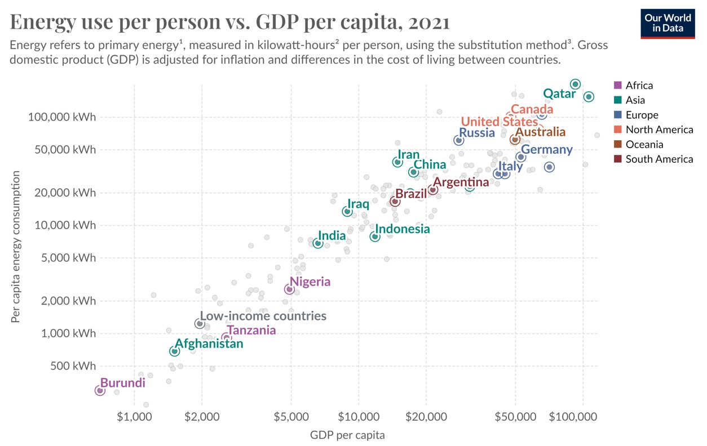

import VideoEmbed from '../../../components/VideoEmbed.astro';
import YouTube from '../../../components/YouTube.astro';

On my way back home, I tried to write down my reflections about the past three months in Tanzania, where we supported the partial electrification of the Geita Gold Mine.

**Some facts about the project:**

🏭 The mine currently receives 40MW of power from 4 Wärtsilä diesel generators located on-site.

🔌 In 2020, the mine embarked on a grid integration project to build a 33/11kV 60MVA substation, connected to the national 220/33kV grid at Mpomvu village, which will also provide power to other 130 villages in the region.

💡 Given the complex operational requirements of the process plant and the weak grid, there is a crucial need for a reliable and secure power supply. That's why a Static Synchronous Compensator is necessary to provide dynamic voltage compensation to support the 33kV bus during grid faults and to regulate its power factor.

🔋 With about 235 GWh/year of energy demand and an average CO2 emissions from the electrical grid of 0.27 kg/kwh (powered by 35% of renewable energy), this project will bring a reduction from 0,14 Mt to 0,063 Mt.

💸 The mine's annual energy expenditure will drastically decrease, with a NPV of 26 million, IIR 46% (over 10 years) and payback period of the investment in less than 2 years.

**Since this investment seems so appealing, it made me search further:**

🌎 OCSE countries are accountable for 1/3 of the C02 emissions and in the last 10 years they had a yearly reduction of about 1%.

🔥 Global Emissions continue to rise, reaching a new record of 37.4 Gt in 2023.

💸 Out of $1.8 trillion of clean energy investments in 2023, developing economies account for about 15% (and they represent roughly a third of global GDP and two-thirds of the world's population).

⛏️ Critical minerals are pivotal for the energy transition and areas like Africa owns over 40% of global reserves.

**In conclusion:**

🟢 I wonder if substantial investments in the electrical grids of OCSE countries is the fastest and most effective way to addressing the global climate crisis and achieving the famous net zero emissions.

🟢 Perhaps exporting cutting-edge technology and expertise to developing countries, that are in the middle of their industrial revolution, could offer a possible answer to the "hard problem" of the energy transition.

🟢 Wouldn't it be better to reconsider (and readapt) the past approach of clean development mechanism CDM from the Kyoto protocol to valorize these investments?

...Back to my experience in Tanzania 🇹🇿. The humbleness of the people I have met and their respect for nature have thought me that this energy transition might have even more relevance in those places, where nature is still part of daily life and people know how to praise it. As they told me as soon as I arrived at Mchauru Village: "Welcome back to the reality". 😄

🏭 Investing in developing countries could be an effective way to fight global warming. However, at the same time, we should work to reduce greenhouse gas emissions per capita in places like the US and Europe, where levels are much higher than in the rest of the world.

**And this might be an even bigger problem:**

💸 Direct investments in the transmission and distribution system, as well as in the ancillary services (primary and secondary markets, capacity markets, FACTS, etc.) need a clear evaluation and communication to the citizen since it might lead to substation increase in their bills.

🌄 The case of the German corridors in striking. The costs associated with transmitting high-voltage energy from wind generation in the North to consumption areas in the South amount to several tens of euros per MWh. These costs should be added to the production price at auctions (so-called "grid parity") and also include additional surcharges to maintain the quality and safety of the electrical service.

OCSE countries should take the lead in this energy transition as they can reduce the so-called green premiums by investing in new innovations.

🟢 Perhaps promoting and reviewing the concept of grid parity, which cannot solely refer to the local cost of production but must include additional costs to the electricity system. For example, nodal pricing, which redistributes some costs associated with the location and intermittency of PV production could be considered. This would foster the rise of Virtual Power Plants (VPPs), where by aggregating the interests of around a hundred households into a mini plant of a few hundred kilowatts, the cost of producing one kWh could be reduced by two-thirds (kind of car pooling but with energy ☀️).

Let me know your thoughts 😊

---

*This is an excerpt from an interview I received due to the Hitachi Sustainability Award. Here, I aim to highlight the project's positive impact on the environment and local communities and summarize some key steps I believe are important to tackle the Energy Transition. I also share a few wishes and aspirations for the people at the forefront of this transition, along with some ideas for my own professional growth.*

<audio controls class="mx-auto my-4">
  <source src="/media/Energy-Interview.mp3" type="audio/mpeg" />
</audio>

*And this is a funny video I made during my 3 months on site 🫠.*

<YouTube id="2NwBkeYKd2U" title="Commissioning in Tanzania" />
