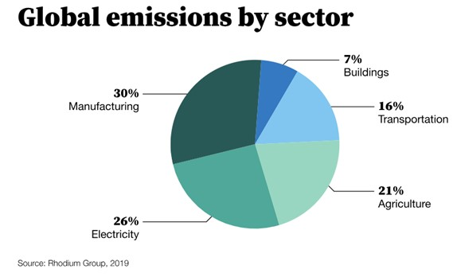

We know that the Energy Transition is quite a complex problem, but the book "How to Avoid a Climate Disaster" helped me to grasp it in smaller and clearer solutions, which I try to summarize here:

🏭 The world typically adds 52 billion tons of greenhouse gases to the atmosphere every year.

This includes:

- 30% from "making things" (mainly cement, steel, plastic)
- 26% from "plugging in" (electricity)
- 21% from "growing things" (plants, animals)
- 16% from "getting around" (planes. Truck, cargo ships)
- 7% from "keeping warm and cool" (heating, cooling, refrigeration)

🌍 The world needs to provide more energy without releasing any greenhouse gases so the poorest can thrive.

👪 The population growth goes down as we improve health.

⚡️ Electricity demand will increase also driven by new ways of making cement and plastic.

**If we want to summarize, the path to zero emissions could be:**

🟢 Electrify every process possible and explore advanced biofuels and electrofuels (aim for zero-carbon cement, steel, fertilizer and plastic).

🟢 Get that electricity from clean energy sources (including next generation nuclear fission and nuclear fusion).

🟢 Use carbon capture to absorb remaining emissions (possibly directly from power plants, as some national agencies are already demanding).

🟢 Discuss and understand the impact of geoengineering (brightening clouds and injecting fine particles into the atmosphere).

🟢 Government policies to close the gap, as energy businesses spend an average of 0.3% on R&D compared to the 10% of IT and pharma industries.

🟢 Adopt more F-gases-free coolants

**All these points depend on a single fact: lower the green premiums. That's why OCSE countries should take the lead in this energy transition as they can reduce this difference between current solutions and their clean alternatives by investing in new innovations.**

Let me know your thoughts 😊

