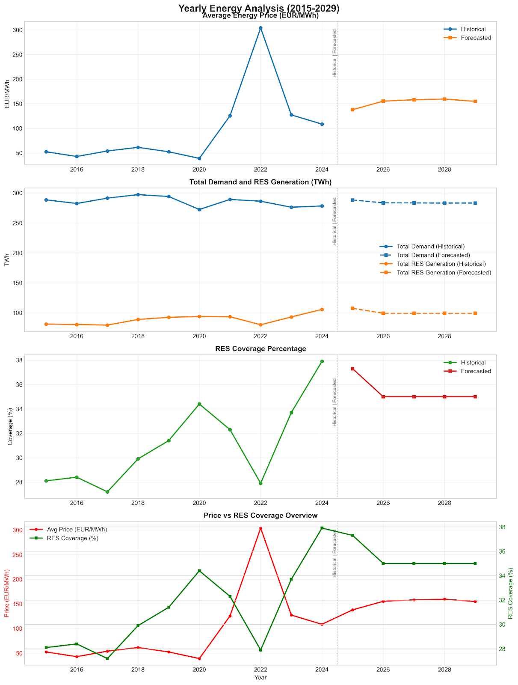

It is clear to me that AI is most useful when combined with solid domain knowledge. This principle inspired my data science project created with Claude MCPs and Cursor ([GitHub repo](https://github.com/SecchiAlessandro/EnergyForecaster)). It is an experiment to analyze the Italian electricity market and predicts energy prices, demand, and renewable energy generation from 2015-2029.

The main question is:

**How will the relationship between energy demand and renewable energy supply evolve in Italy's energy market over the next 5 years, and what are the implications for energy investment planning and grid management?**

## Key Findings 📉

The final results reveal that "business as usual" won't achieve increasing RES coverage. Without a functional capacity market, policy intervention, or accelerated deployment, RES coverage might stagnate or decline relative to growing demand. Seasonal mismatches persist, highlighting the critical importance of storage technologies and demand response mechanisms.

The projection showing RES plateauing at ~35% while prices stabilize at 150-160 EUR/MWh could reflect economic reality:

- **Price Floor Needed:** Investors require price certainty to continue building renewables.
- **Gas Plants Still Required:** Italy needs gas capacity for non-renewable periods, and these plants need higher prices during operating hours to remain viable.
- **Grid Stability Costs:** As RES increases, system costs for balancing and reserves rise.

The sharp drop in 2022 can be explained by the perfect storm of the European energy crisis:

- **COVID aftershocks:** Delayed renewable project completions due to supply chain disruptions.
- **Geopolitical crisis:** The Russia-Ukraine war and pipeline disruptions made gas-fired backup generation extremely expensive.
- **Nuclear shortfall:** France's major nuclear maintenance issues reduced baseload capacity.
- **Capacity gap:** Many backup fossil plants had been decommissioned.

The result? Renewable generation couldn't scale up quickly enough to meet demand during unusual low wind and solar conditions across Europe.

## The RES-Price Paradox

The data reveals an intriguing inverse correlation: as RES coverage increased from ~28% (2022) to ~38% (2024), prices dropped from ~300 to ~110 EUR/MWh. This reflects Italy's market dynamics:

> "When renewable energy sources exceed 40% of total production...the price is no longer set by the cost of gas-based thermoelectric plants, but by the unit cost—close to zero—of renewable energy" ([PricePedia](https://www.pricepedia.it/en/magazine/article/2024/11/12/the-impact-of-renewable-sources-on-the-italian-pun-a-detailed-analysis/))

Here's the paradox: while high RES penetration drives prices down (benefiting consumers), it creates investment uncertainty:

1. **Merit Order Effect:** Renewables push expensive gas plants out of the market, collapsing prices.
2. **Revenue Uncertainty:** Solar/wind investors face "cannibalization"—their success destroys revenue streams.
3. **"Missing Money" Problem:** Low average prices make financing new renewable projects harder.

## Market Design Solutions in Progress

Italy is addressing these challenges through:

1. **Capacity Markets:** Paying for availability, not just energy produced.
2. **Storage Incentives:** €4.8 billion committed in 2023 alone for large-scale battery projects. 🔋
3. **Regional Price Signals:** The electricity market was segmented into different zones 27% of the time due to transmission grid limitations.

**This explains why the forecast shows both RES and prices plateauing—it's not just technical constraints but economic equilibrium. Without policy intervention (subsidies, mandates, carbon pricing), the market might naturally settle at this level rather than reaching the 65% RES target by 2030.**

## Capacity Markets

Traditional electricity markets only pay for energy delivered (€/MWh). Capacity markets add a second revenue stream—paying for being available (€/MW/year). This transforms RES economics:

**Impact on RES Investment:**

- **De-risks Projects:** Guaranteed capacity payments regardless of energy market prices.
- **Enables Higher RES Penetration:** Projects remain viable even when energy prices crash.
- **Changes Optimal Mix:** Encourages pairing renewables with storage for "firm capacity".

**Price Effects:**

- **Higher but More Stable:** Energy prices might average higher but with less volatility.
- **Reduced Price Spikes:** More reliable capacity means fewer scarcity events.

## Storage

Storage has a direct price impact:

1. **Arbitrage Smoothing:** Storage charges during low prices (high RES) and discharges during high prices.
2. **Peak Shaving:** Reduces extreme price spikes.
3. **Valley Filling:** Prevents prices from crashing to zero.

**Current Storage Capacity (September 2024)**

- **Total:** ~12-13 GW
- **Battery Storage:** 11.39 GWh / 5.03 GW
- **Pumped Hydro:** ~7-8 GW (existing legacy infrastructure)

**2030 Targets**

- **Total:** 95 GWh / 22.5 GW
- 71 GWh of NEW grid-scale storage
- 11 GW utility-scale standalone facilities
- 8 GW pumped hydro (mostly existing)
- 4 GW distributed systems

## The New Market Equilibrium ⚖️

**Without Storage/Capacity Markets (current forecast):**

- RES hits ~35% and stalls due to revenue collapse.
- Prices remain volatile (0-300 EUR/MWh intraday).
- Average settles ~150 EUR/MWh.

**With Storage/Capacity Markets:**

- RES could reach 60-70% by 2030 while maintaining investment viability.
- Price volatility could drop (50-200 EUR/MWh range).
- Average prices might be slightly lower (~120-140 EUR/MWh) due to reduced scarcity events.

Also note that storage provides more than energy shifting:

- Frequency Regulation: Worth €20-50/MW/hour in some markets.
- Voltage Support: Enables more RES on weak grids.
- Black Start Capability: Reduces system costs.

**These additional revenue streams make RES+storage combinations more profitable than simple energy prices suggest.**

## Conclusion

These preliminary insights could be practically used for:

1. **Grid & Storage Investment Planning:** Utilize the RES-load mismatch analysis to identify optimal locations and sizing for energy storage solutions, flexible loads, or necessary grid infrastructure upgrades.
2. **Corporate Sustainability Strategy:** For sustainability-focused companies, this knowledge enables alignment of energy-intensive operations (manufacturing, data centers) with regions and times experiencing RES surplus.
3. **Energy Policy and Advocacy:** Support local governments in developing more effective energy policies. Use forecast data to advocate for targeted incentives in deficit areas, encouraging further RES buildout or suggesting implementation of capacity markets and flexible tariff structures.
4. **Investment & Finance:** Provide data-driven guidance to green investment funds and utility companies on capital allocation strategies. Develop financial models (cost-benefit and LCOE analysis) identifying high-return opportunities in RES projects, energy storage, or efficiency initiatives based on anticipated surplus/deficit patterns.

This data science project demonstrates how AI capabilities can analyze large datasets to uncover interesting insights. The forecast essentially assumes a "market-only" scenario in order to understand where policy and grid/storage investments play a crucial role.

Future improvements might consider:

- Weather variables (temperature, wind speed, solar radiation)
- Economic indicators (GDP, industrial production)
- Holiday calendars and special event
- Cross-border/zonal flow considerations

---

**Addendum — 08.09.2025**

Investments in power quality solutions in transmission and distribution systems are necessary, but not enough to raise the share of renewables in the grid. 📉

The **RES-Price Paradox** reveals a fundamental market failure: renewable penetration beyond 35-40% creates a revenue collapse that slows further investment. Above this share of RES, there is the so-called "Missing Money" Problem where low average prices make financing new renewable projects harder.

The Italian MACSE (Mechanism for the Procurement of Electric Storage Capacity) could be the turning point. It represents a long-term, stable financial signal to avoid the RES coverage to stagnate. Its value is calculated based on the benefits of "avoided overgeneration", a smart way to consider negative externalities in the final price. 🌱

Other countries have different energy mixes, hence they have different philosophies:

- **Germany:** "Let the market handle it naturally"
- **UK/Belgium/Poland:** "technology neutral capacity markets"
- **France:** "Suppliers find their own capacity solutions"

There is no one-size-fits-all solution. But, it's quite interesting to see novel approaches and how the electricity market is evolving. Maybe we will adapt the ETS (Emission Trading System) too, into a parallel market mechanism for renewables with fixed remuneration disconnected from spot prices.
