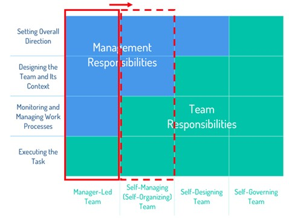

import GooglePhotosAlbum from '../../../components/GooglePhotosAlbum.astro';
import { albums } from '../../../data/albums';

Some general thoughts about two weeks working in Chennai with the local team and one week exploring the beauties of Tamil Nadu.

As I wrote before:

*"Success is a story of people who were given a special opportunity to work really hard and seized it, and who happened to come of age at a time when that extraordinary effort was rewarded by the rest of society. It is a product of history and community, of opportunity and legacy of the world in which we grew up. We need to be aware of all these variables so as to replace the arbitrary advantages with a society that provides opportunities for all."*

I believe, this is the time, where that special opportunity is finally given to the Indian team: the engineering team is receiving full ownership of project execution for the first time, transitioning from a purely manager-led structure to a self-managing one 💼.

I believe this ownership will enhance my colleagues' work-life balance and overall well-being, both professionally and personally.

**Now, some general impressions outside the office.**

On the streets, chaos reigns. Traffic runs 24/7, horns are used simply to signal your presence. Luxury and decay coexist in proximity. Here, the so-called negative externalities impacts everyone: the middle-upper class breathe the same polluted air and walk the same messy streets.

It's true, I haven't felt the American (or Chinese) dream of the self-made man here. But I can't generalize from a single state out of twenty-eight.

Indians are kind, respectful, and peaceful, driven by instinct and faith, by strong family values. An implicit natural contract lives within the family: take care of your elderly parents, as social security is often not enough. And these bonds often temper those fantasies of emigrating for a gold rush abroad.

After visiting relatively smaller cities like Tiruvannamalai, Mamallapuram, Pondicherry, and Chidambaram, and talking with different people I can confirm that your home is where your family and friends are. And you can build your own life with your own rules wherever you want, if you want to. You can move to a new city or change jobs. But what truly makes you feel at home is the purpose you need to find and the sense of belonging given by the community you surround yourself with. Purpose and belonging can exist everywhere, and after 4+ years in Switzerland as an expat, I feel lucky to have found someone to share this journey with.

Finally, this journey kept my feet on the ground, including on a topic I've been recently hyped about. AI is exciting, but how far is it from the daily lives of billions of people? Electricity and the combustion engine disrupted multiple industries because they entered the physical world. AI needs to do the same, but there is little space for autonomous vehicles or robots in much of daily life in places like there. In a country where white-collar workers represent about 20% of the total workforce (compared to over 60% in Europe and the US), how is AI actually improving lives?

Maybe the real opportunity lies in education 📚: AI used to know more, to learn how to make, how to heal. AI as a personal advisor to improve your business, track your trades, help you sell your products online, launch new services. AI to become an entrepreneur, if you want to.

<GooglePhotosAlbum {...albums.india} />
