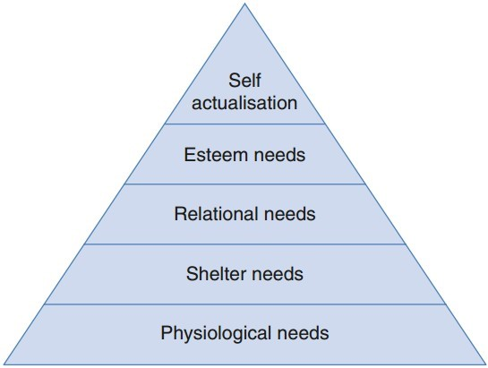

import GooglePhotosAlbum from '../../../components/GooglePhotosAlbum.astro';
import { albums } from '../../../data/albums';

> "The most beautiful experience we can have is the mysterious. It is the fundamental emotion that stands at the cradle of true art and true science. He to whom this emotion is a stranger, who can no longer wonder and stand rapt in awe, is as good as dead: his eyes are closed."

Over the past month, I've been reminded of the importance of certain emotions: inspiration and motivation, which are fundamental drivers for uncovering life's mysteries and fostering innovation. Some events, have triggered few reflections that I'd like to write down to better organize my thoughts.

Once I've read that the last metamorphosis of the spirit is represented by the "child", as a symbol of creativity, spontaneity, playfulness and openness. At this stage, we begin to wonder about everything again but with a fresh perspective. What are the unresolved mysteries of life? Which goals can we set for ourself? How can we inspire others?..

> **"He who has a why to live can bear almost any how."**

Thus, we start exploring different aspects of life, trying to push beyond apparent limitations. We live multiple stories, encounter new cultures, begin new studies - driven by the desire to fill a void or bridge a gap.

We shall be always careful to use knowledge as a means, rather than pursuing it for its own sake. Knowledge should be disinterested, not driven by a "will to power," as it can sometimes disconnect from the more vital, instinctual aspects of life - passion, love, and creativity.

But how can we sustain these important aspects of life?

Needs can evolve into drives, which may result in motivation. In other words, to maintain motivation, we must leave some needs unfulfilled at all times.

The goal - at least for me - is to remain in the state of self-actualization: what I can be, I must be. I don't want to stray too far, but this state acknowledges the concept of linking justice to virtue (Aristotelism). Society should not just aim to maximize welfare (utilitarianism) or respect individual rights (libertarianism); it should also promote the moral character of individuals.

I like the Maslow pyramid, as it highlights the importance of professional development and equal opportunities.

Some practical advices to (I have recevied during my first classes at ETH) in order to cope with this slef and collective development are:

- Have a feedback loop, where you're constantly thinking about what you've done and how you could be doing it better (togheter).
- Capacity is the balance between Emotional, Physical, Spiritual and Mental Energy, don't try to manage your time, manage your energy.
- Identify the gold hours for you and your team and do not set meetings there.
- You can create an index (such as a subjective happiness index) to get a feedback from your team that goes beyond the daily business.
- Reserve some time in your calendar just to think.
- Consider the color map in change management projects.
- Ask what are your needs, and then the needs of your needs, and then ask why you have that needs.

Finally, a list of some quotes that often come to mind when it's about being inspired. They may seem a bit trivial or loosely connected, but I believe they serve as valuable fuel for finding certain answers:

- I think it's possible for ordinary people to choose to be extraordinary.
- Your time is limited, so don't waste it living someone else's life.
- Everything around you that you call life was created by people no smarter than you, and you can influence it.
- The greater the risk, the greater the reward.
- People don't buy what you do; they buy why you do it.
- It's not important which company you work for, but which leader you work for.
- Most people don't get experiences because they never ask.
- If you haven't found the right friend or partner you are looking for, it is just because you haven't talked enough with different people.
- What you do with your day, is how you live your life.
- There is only one way to see things, until someone shows us how to look at them with different eyes.

I want to close this train of thoughts with a reflection from one of the last books I read: *Outliers: The Story of Success.*

***Success is a story of people who were given a special opportunity to work really hard and seized it, and who happen to come of age at a time when that extraordinary effort was rewarded by the rest of society. It is a product of history and community, of opportunity and legacy of the world in which we grew up. We need to be aware of all these variables so as to replace the arbitrary advantages with a society that provides opportunities for all.***

Here are some of the sources of inspiration I mentioned earlier:

- The kickoff of my studies in management, economics and energy policy.
- Training sessions for Hitachi Energy with the service engineers from around the world in Switzerland.
- A volleyball weekend training event with team-building activities.

<GooglePhotosAlbum {...albums.august24} />
